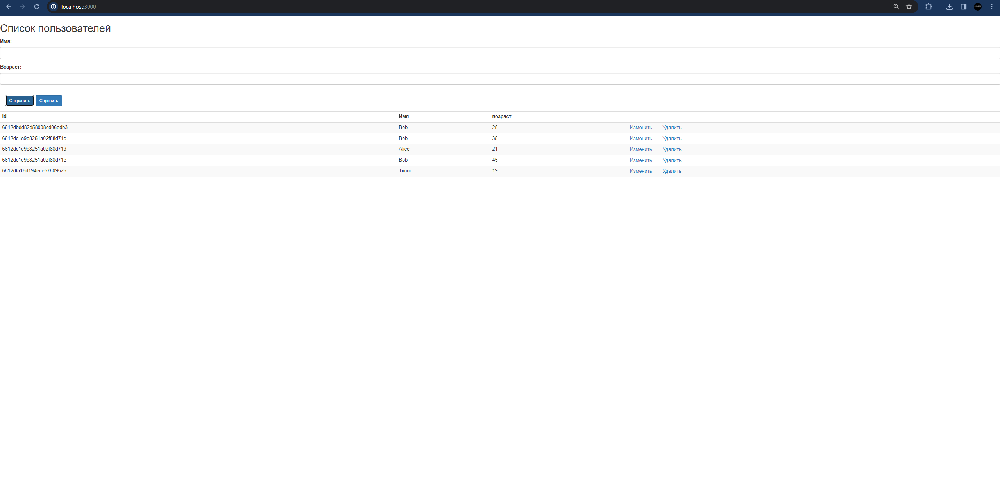

# Задание по фронту и бэкэнду "Задание No8"

Для начала должен быть установлен MongoDB Server

https://www.mongodb.com/try/download/community-kubernetes-operator

Так же должен быть установлен MongoDB Shell или MongoDB Compass

https://www.mongodb.com/try/download/shell

Еще должен быть установлен Node.js

## Результат

